# [Pokédex](https://kjentleman.github.io/pokedex/)
Complete the Pokédex by scanning QR codes to catch Pokémon and defeat trainers.

## Catch Pokémon

  
Ivysaur

  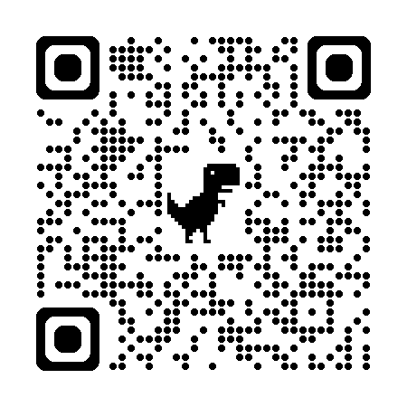
  
<a href="https://kjentleman.github.io/pokedex/?catch=P5N972">catch</a>

  
Charizard

  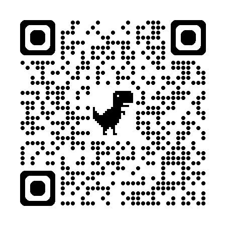
  
<a href="https://kjentleman.github.io/pokedex/?catch=P79XL5">catch</a>

  
Squirtle

  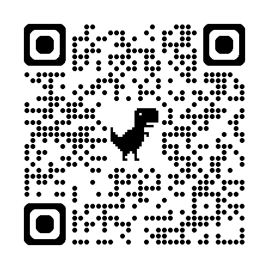
  
<a href="https://kjentleman.github.io/pokedex/?catch=P19M2K">catch</a>

  
Pikachu

  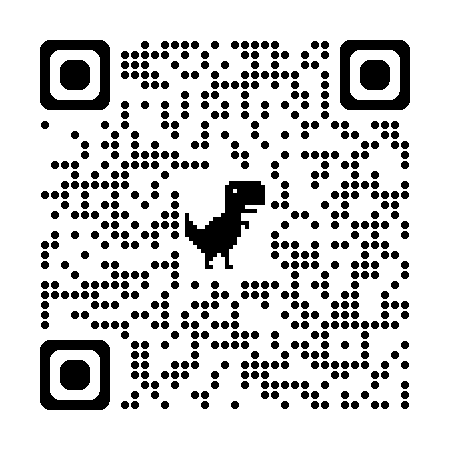
  
<a href="https://kjentleman.github.io/pokedex/?catch=P66IJ2">catch</a>

  
Machoke

  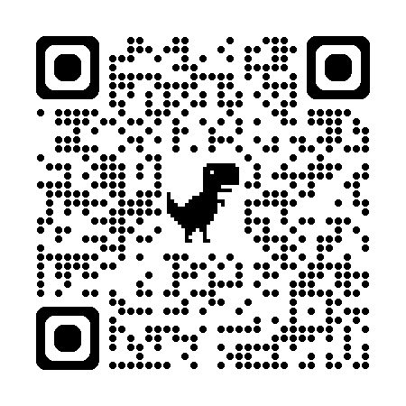
  
<a href="https://kjentleman.github.io/pokedex/?catch=P5Y42Q">catch</a>

  
Exeggutor

  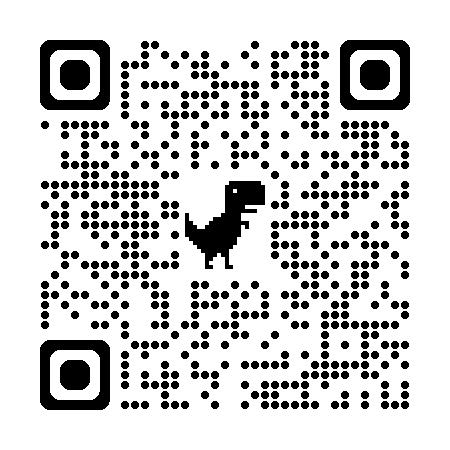
  
<a href="https://kjentleman.github.io/pokedex/?catch=P7HYNK">catch</a>

  
Ditto

  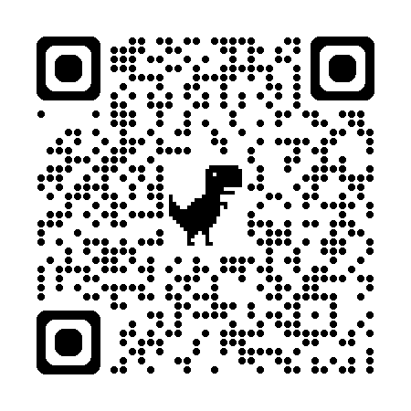
  
<a href="https://kjentleman.github.io/pokedex/?catch=P3QQG4">catch</a>

  
Vaporeon

  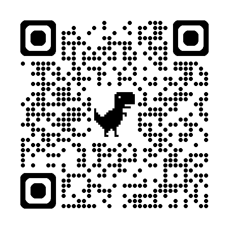
  
<a href="https://kjentleman.github.io/pokedex/?catch=P1B7YP">catch</a>

  
Bellosom

  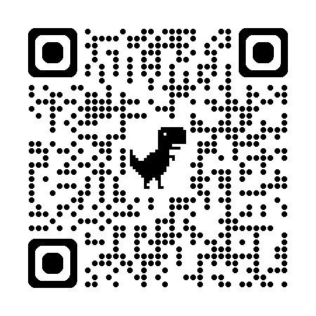
  
<a href="https://kjentleman.github.io/pokedex/?catch=P10A3L">catch</a>

## Defeat Trainers

  
Misty

  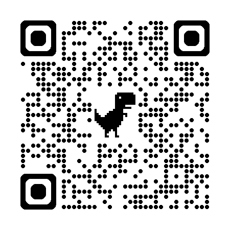
  
<a href="https://kjentleman.github.io/pokedex/?catch=T48HQ3">defeat</a>

  
Lt. Surge

  
  
<a href="https://kjentleman.github.io/pokedex/?catch=T895GO">defeat</a>

  
Team Rocket

  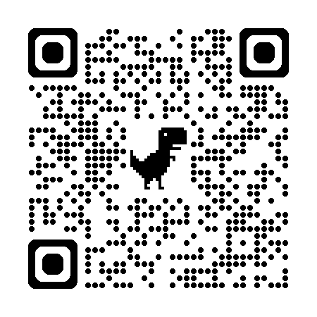
  
<a href="https://kjentleman.github.io/pokedex/?catch=TCSTRP">defeat</a>

  
Ash Ketchum

  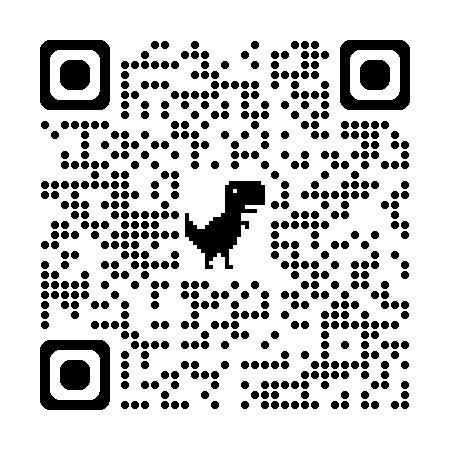
  
<a href="https://kjentleman.github.io/pokedex/?catch=T2JRD4">defeat</a>

  
May

  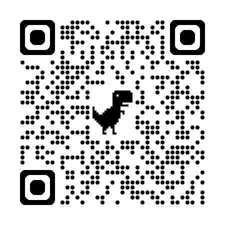
  
<a href="https://kjentleman.github.io/pokedex/?catch=T30IMX">defeat</a>

  
Team Aqua

  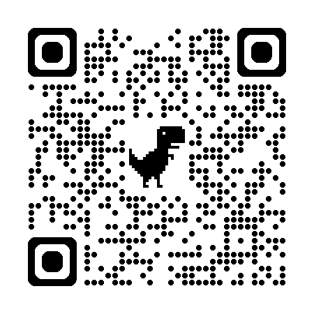
  
<a href="https://kjentleman.github.io/pokedex/?catch=T942HN">defeat</a>

## Debug

  
Catch 'Em All

  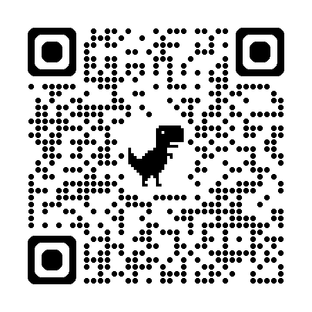
  
<a href="https://kjentleman.github.io/pokedex/?catch=emall">catch</a>

  
Reset

  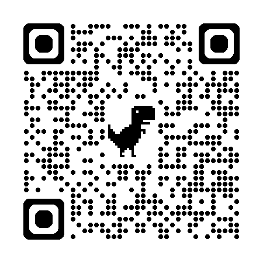
  
<a href="https://kjentleman.github.io/pokedex/?catch=release">reset</a>

